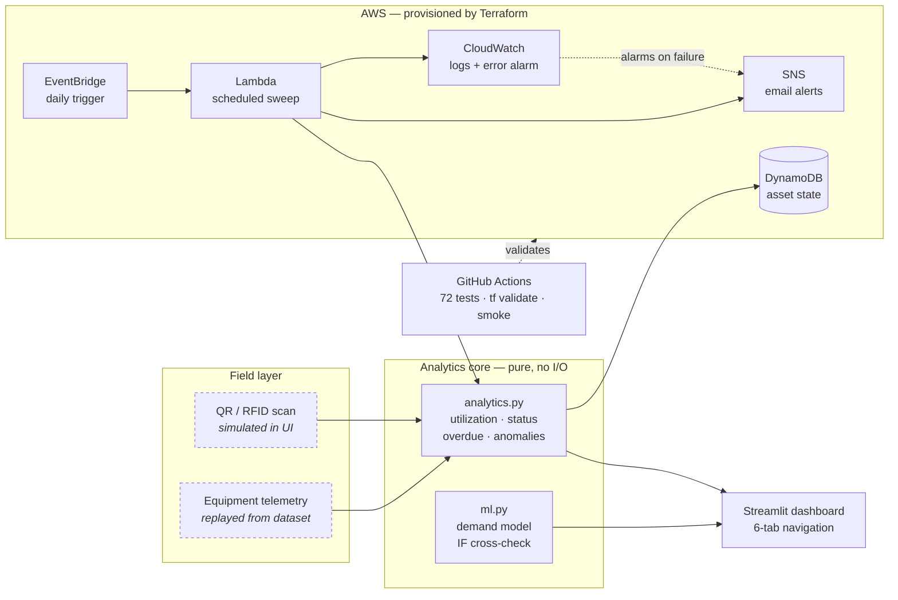

# Smart Rental Tracking

Equipment rental monitoring built on the Caterpillar hackathon dataset (7 assets, `data/equipment.csv`).
All decision logic lives in pure functions in `src/analytics.py` — no AWS, no network, no framework
imports — so it is fully unit-testable and the dashboard is a thin rendering layer on top.

## Run

```bash
python3 -m venv .venv
.venv/bin/pip install -r requirements.txt

.venv/bin/python -m pytest -q          # 72 tests
.venv/bin/streamlit run app/dashboard.py
```

Dashboard: http://localhost:8501

## Layout

| Path | Role |
|---|---|
| `data/equipment.csv` | Source dataset, `NULL` strings preserved as in the original sheet |
| `src/models.py` | `Equipment` dataclass mirroring the CSV columns |
| `src/loader.py` | CSV → `Equipment` objects; normalises `NULL`/blank to `None` |
| `src/analytics.py` | Pure logic: utilization, status, overdue, anomalies, site summary |
| `src/ml.py` | Demand prediction + Isolation Forest cross-check |
| `src/lambda_handler.py` | Scheduled sweep; pure `build_payload()` + thin AWS shim |
| `tests/` | 72 tests across analytics, ML and the Lambda payload |
| `app/dashboard.py` | Streamlit UI (black / white / Cat yellow `#FFCC00`) |
| `infra/` | Terraform: DynamoDB, SNS, Lambda, EventBridge, CloudWatch, budget |
| `.github/workflows/ci.yml` | Tests + `terraform validate` + dashboard smoke test |

## Verification status

Be precise about this when presenting:

| Item | State |
|---|---|
| 72 unit tests | **Verified** — `pytest -q`, 72 passed |
| Dashboard, all 8 sections | **Verified** — rendered in headless Chromium, 0 console errors |
| Check-in guardrail | **Verified** — blocked empty submit in a real browser session |
| Terraform config | **Verified** — `terraform init` + `validate` pass, `fmt -check` clean |
| GitHub Actions CI | **Verified** — green on every push: tests + `terraform validate` + smoke test |
| `terraform plan` / `apply` | **Not run** — requires AWS credentials |
| Deployed AWS resources | **None yet** |
| SNS email delivery | **Not verified** — needs a deployed topic + confirmed subscription |
| Dockerfile | **Not built** — Docker not installed where it was authored |

## Core metric

`utilization_rate = engine_hours / (engine_hours + idle_hours)`, returning `0.0` when both are zero.
Under-utilized below 20%, healthy at or above 80%. This one number drives the IDLE badge, the
under-utilization anomaly, and the per-site averages.

## Status precedence

`UNASSIGNED > OVERDUE > IDLE > ACTIVE`

An asset nobody owns is the more urgent problem, and it is also the one that makes an overdue date
meaningless — there is no operator to chase for the return. EQX1002 and EQX1007 are both technically
overdue, but they surface as UNASSIGNED.

## What the dataset actually says

Two readings worth stating up front, because they change what the features do:

**1. The NULLs are in Site ID and Last Operator ID, not Check-In Date.** Both EQX1002 and EQX1007 have
valid check-in dates (2025-03-10 and 2025-03-20). So the anomaly is *"checked out with no site
allocation and no operator"* — an asset that is being billed while nobody knows where it is or who has
it. That maps directly to the brief's first pain point, equipment lost or unaccounted for.

**2. Every row has a Check-Out Date, and `check_out − check_in == rental_days` in all 7 cases.** These
are closed historical rentals. Overdue is therefore computed as
`expected_return = check_out_date + rental_days` per spec — the scheduled return of the *next* rental
cycle. At the default `today` of 2025-06-01 all seven are already past that date (5 OVERDUE +
2 UNASSIGNED), so the sidebar date input exists to make the logic demonstrable: **set it to 2025-03-05
to see all four statuses at once** (2 ACTIVE, 2 IDLE, 1 OVERDUE, 2 UNASSIGNED).

| Asset | Utilization | Reading |
|---|---|---|
| EQX1005 | 100% (8 engine / 0 idle) | Healthy baseline — the shape of a well-deployed asset |
| EQX1003 | 94% | Healthy |
| EQX1006 | 33% | Acceptable |
| EQX1004 | 18% | Under-utilized — reallocate before renting another excavator |
| EQX1001 | 13% | Under-utilized |
| EQX1002 | 0% (0 engine / 11 idle, 20 days) | Ghost asset — rented, never used, unassigned |
| EQX1007 | 0% (0 engine / 12 idle, 12 days) | Ghost asset |

The unassigned bucket accounts for **364 idle hours** billed against zero engine hours.

## Feature → expected outcome

| Brief | Where |
|---|---|
| Asset dashboard with live status | Colour-coded badges + per-row utilization bars |
| Check-in / check-out (QR/RFID sim) | Scan widget; state held in `st.session_state` |
| Usage logging | Engine/idle hours per day, rental days, expected return, days to due |
| Summary: rented hours, per site, downtime | Per-Site Summary chart + table from `site_summary()` |
| Overdue alerts and notification | Alerts panel, `is_overdue` / `due_soon(threshold=2)` |
| Anomaly detection | `detect_anomalies()` → plain-language reasons in the alerts panel |

**The check-in guardrail is the fix for EQX1002.** A scan-in is rejected unless both a Site ID and an
Operator ID are supplied, which makes a NULL check-in structurally impossible rather than a data-entry
convention. Verified in a browser: selecting EQX1002 and submitting empty fields is blocked and records
nothing; supplying both clears the UNASSIGNED status.

## Machine learning — and why the rules still win

### Demand prediction (`predict_demand`)

Random Forest predicting rental duration from equipment type, site and usage intensity.

| | R² | MAE |
|---|---|---|
| Leave-one-out (reported) | **0.42** | 4.4 days |
| Always-predict-the-mean baseline | 0.00 | 5.5 days |
| In-sample (shown for contrast only) | 0.94 | — |

Two deliberate choices, both worth defending out loud:

- **`rental_days` is the target, so it is excluded from the features.** An earlier draft had it in both
  places. That leaks the label and lifts in-sample R² to 0.97 while teaching the model nothing —
  `rental_days` came out as the single most important "feature". `test_ml.py` has a regression guard so
  it cannot come back.
- **Metrics are leave-one-out cross-validated, not in-sample.** At n=7 a `train_test_split` with
  `if len(df) >= 10` silently sets `X_train = X_test = X` and reports fiction.

The model beats guessing the mean by 1.1 days. That's a real but modest gain, and it is the honest
ceiling on seven rentals. This is a duration model, not a time-series forecast — one closed rental per
asset with no repeat cycles means there is no series to extrapolate.

### Anomaly detection: Isolation Forest inverts on this fleet

Run unsupervised over usage features, Isolation Forest flags **EQX1005 (100% utilization) and EQX1003
(94%)** — the two healthiest machines — and marks both ghost assets as normal. Agreement with the rules
is **0%**: it disagrees on all seven assets.

The cause is structural, not a tuning problem: 5 of 7 assets are under-utilized, so the statistically
rare pattern is *a machine being used properly*. Outlier detection finds rarity; the brief asks for
misuse. On this fleet those are opposites. Three framings were tested and all failed:

| Framing | Result |
|---|---|
| Unsupervised, `contamination` 0.15 / 0.25 / 0.3 / auto | Flags the healthy assets every time |
| Trained on healthy assets only | Degenerates — n=2, all scores 0.0 |
| Trained on 400 synthetic healthy samples | Scores saturate; still flags EQX1005 |

**So rule-based detection is the shipping signal and Isolation Forest is a labeled cross-check.** That
is an engineering conclusion backed by tests (`test_isolation_forest_flags_the_healthiest_assets`), not
a fallback. A deep-learning autoencoder would inherit the same n=7 problem.

## Architecture



Dashed nodes are simulated: no scanner hardware, and telemetry replays the
supplied dataset rather than streaming live. Everything else runs.

## AWS architecture

`infra/` provisions the alerting pipeline: DynamoDB (asset state, on-demand billing, site GSI) → Lambda
(the sweep, reusing `analytics.py` unchanged) → SNS (email) with EventBridge scheduling, a CloudWatch
error alarm on the sweep itself, and a $5 monthly budget guardrail. IAM is least-privilege: publish to
one topic, read/write one table.

`terraform validate` passes and `fmt -check` is clean. **Nothing has been deployed** — see the
verification table above. To deploy:

```bash
cd infra
terraform init
terraform plan -var="alert_email=you@example.com"    # needs AWS credentials
```

The Lambda needs the AWS-managed pandas layer (`pandas_layer_arn`) because `loader.py` imports pandas;
the ARN is region-specific and the variable documents how to find it.

## Known gaps

- **Fuel usage and GPS location** are in the brief's usage-logging outcome but absent from the dataset,
  so no column was invented for them. Adding them is a loader + dataclass change; the analytics
  signatures do not move.
- **No time-series forecasting.** See the demand section — the data does not support it. The defensible
  aggregate: the unassigned bucket carries 364 idle hours against zero engine hours, so the
  recommendation is reallocation before new rentals.
- **`data/equipment.csv` is still the source of truth**, not DynamoDB. The Terraform provisions the
  table but no migration or write path exists yet.
